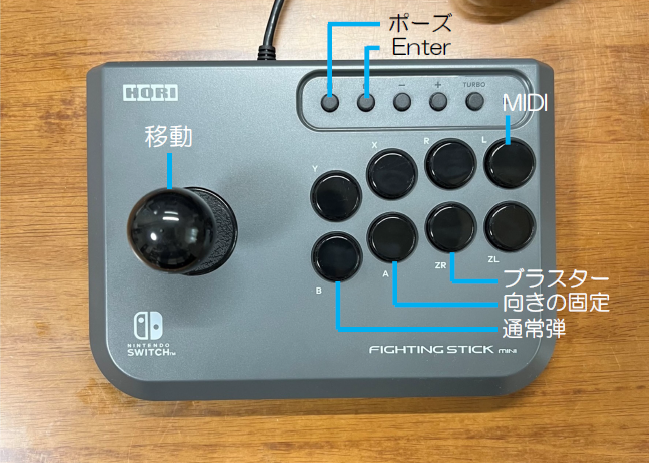
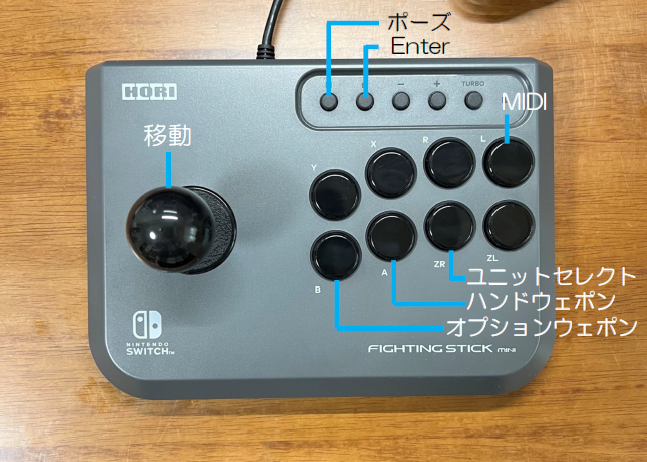

# X68000 Z版グラナダ・FZ戦記アクシスをHORI ファイティングスティックmini for Nintendo Switch(NSW-149)で3ボタン操作で遊ぶ

## 概要
HORI ファイティングスティックmini for Nintendo Switch(NSW-149)をX68000 Zに繋ぎメガドライブ版グラナダ風の3ボタン操作で遊べるようにするスケッチです。FZ戦記アクシスも3ボタンで操作できます。

## 準備
Arduino+USB Host Shieldを組み合わせた回路が必要です。  
また、スケッチを書き込むためにArduino IDEとUSB_Host_Shield_2.0ライブラリの環境が必要です。  

## 使い方
Arduino+USB Host Shieldを組み合わせた回路にスケッチを書き込みます。  
X68000 ZとArduino+USB Host Shieldを繋ぎ、HORI ファイティングスティックmini for Nintendo Switch(NSW-149)を接続をします。  

グラナダについては、メガドライブ版グラナダのように、自機の向きを固定しつつブラスター発射したりできるようになります。  
また、Lボタン押しながらグラナダ・アクシスを起動することでMIDIモードで起動することができます。  

ただし、このスケッチではHORI ファイティングスティックmini for Nintendo Switch(NSW-149)でX68000 Zのゲームメニューの操作はできませんので、通常のゲームコントローラーやキーボードを併用してグラナダ・FZ戦記アクシスを起動してください。  

## キー設定
### 【グラナダ】  
  
キャプチャーボタン…ポーズ  
HOMEボタン…Enter（ディスク選択など）  

スティックレバー…移動

Bボタン…通常弾  
Aボタン…向きの固定  
ZRボタン…ブラスター  
Lボタン…MIDI  

### 【FZ戦記アクシス】  
  
キャプチャーボタン…ポーズ  
HOMEボタン…Enter（ディスク選択など）  

スティックレバー…移動

Bボタン…オプションウェポン  
Aボタン…ハンドウェポン  
ZRボタン…ユニットセレクト  
Lボタン…MIDI  

## リリースノート

### 0.0.1

初版
